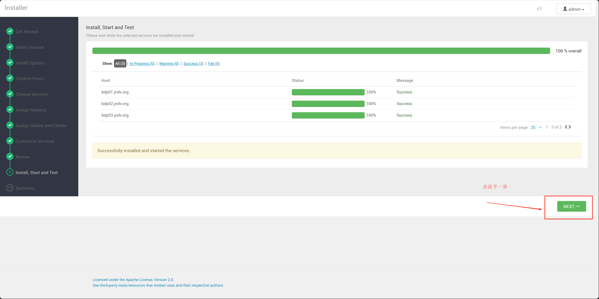

# 一、初始化进行免密和更新hostname
使用ftp拷贝scripts到bdp01服务器，第一第二步骤要用到，执行完可以删掉


这是免密和更新hostname脚本，
copykey.sh是免密脚本，免密脚本需要创建host文件
直接执行sh copykey.sh即可

updatehostname.sh是更新hostname脚本，需要更新/etc/hosts文件
直接执行sh updatehostname.sh即可

执行完以上脚本需要重启所有服务器！！！

# 二、执行ansible脚本
```bash
yum install ansible -y
```

进入ansible目录
修改conf里面的hosts文件，如果总数是6台机器就不用动


修改config.yaml（x86架构）或者config-aarch64.yml（arm架构）

如果是测试环境不用修改
如果是生产环境需要在bdp01安装http
```bash
yum install httpd
systemctl start httpd && systemctl enable httpd
```

然后需要拷贝http://repo.jndv.org/bdp/文件夹到bdp01下面/var/www/html/

然后执行run.sh，如果是arm需要注释掉run.sh里面的x86的部分

# 三、设置mysql
执行完成之后在bdp01直接执行以下脚本
```bash
MYSQL_PASSWORD='i@1LH*I%Wju9'
docker exec mysql bash -c "mysql -uroot -p\"${MYSQL_PASSWORD}\" -e \"CREATE USER 'ambari'@'%' IDENTIFIED BY 'ambari'\""
docker exec mysql bash -c "mysql -uroot -p\"${MYSQL_PASSWORD}\" -e \"GRANT ALL PRIVILEGES ON *.* TO 'ambari'@'%';\""
docker exec mysql bash -c "mysql -uroot -p\"${MYSQL_PASSWORD}\" -e \"CREATE DATABASE ambari\""
docker cp /var/lib/ambari-server/resources/Ambari-DDL-MySQL-CREATE.sql mysql:/opt/Ambari-DDL-MySQL-CREATE.sql
docker exec mysql bash -c "mysql -uroot -p\"${MYSQL_PASSWORD}\" --database=ambari < /opt/Ambari-DDL-MySQL-CREATE.sql"
docker exec mysql bash -c "mysql -uroot -p\"${MYSQL_PASSWORD}\" -e \"FLUSH PRIVILEGES\""
```
# 四、设置ambari-server
```bash
# 快速设置ambari
dbhost=bdp01.jndv.org
ambari-server setup --jdbc-db=mysql --jdbc-driver=/usr/share/java/mysql-connector-java.jar -s
ambari-server setup --java-home=/usr/local/java --database=mysql --databasehost=${dbhost} --databaseport=3306 --databasename=ambari --databaseusername=ambari --databasepassword='ambari' -s
```

# 五、安装mpack
然后将/var/www/html/bdp/tarball-ambari-mpack-1.0.0.tar.gz拷贝到/opt/目录下面

```bash
# scp -r /www/repo/bdp/ 192.168.1.71:/var/www/html/ 这个只能测试环境用，生产环境需要ftp
cp /var/www/html/bdp/tarball-ambari-mpack-1.0.0.tar.gz /opt/
# 安装mpack
ambari-server install-mpack --mpack=/opt/tarball-ambari-mpack-1.0.0.tar.gz
# 重启ambari-server
ambari-server restart
```

# 六、安装大数据平台
进入网页
http://bdp01.jndv.org:8080
账号密码 admin/admin


repo地址填http://repo.jndv.org/bdp/x86_64/或者http://repo.jndv.org/bdp/aarch64/


第7步需要
kafka-broker选择bdp04,bdp05,bdp06
frontend选择bdp06
其他不用动


第8步,需要
datanode和nodemanager全部勾选，
Backend选择bdp03,bdp04,bdp05
其他不用动


如果挂载磁盘在根目录就不用改，如果挂载到/opt/就改一下



等待安装完成，没有报错就可以了


后面可以自行设置防火墙，但是集群内部服务器必须设置白名单